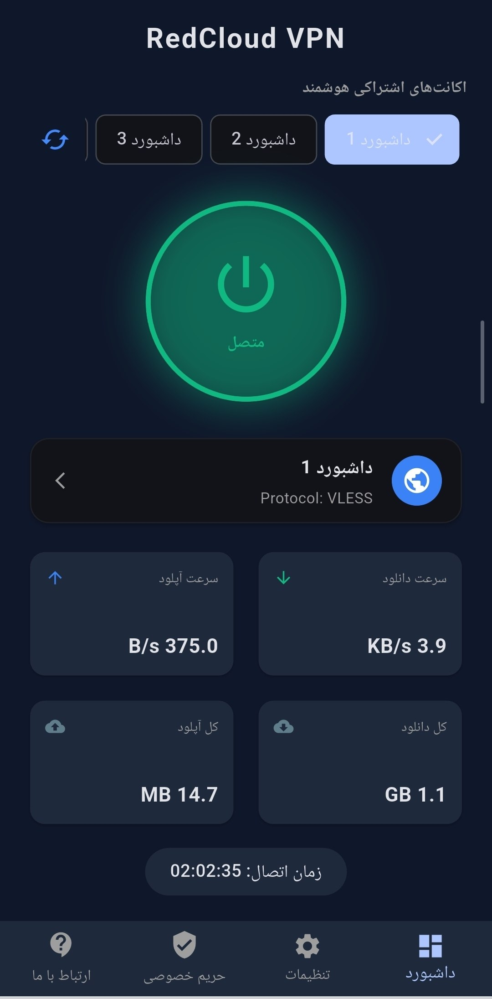

# RedCloud VPN (Android Client)

A modern, fast, and secure V2Ray/Xray VPN client for Android built using **Flutter** and the **Xray-Core** Go engine. This application routes system-wide network traffic through encrypted tunnels, bypassing censorship with automated, high-performance background processes.

---

## 🌟 Features / ویژگی‌ها

### English
* **Unified Core (Xray-Core)**: Securely supports VLESS, VMess, Trojan, and Shadowsocks protocols natively.
* **Concurrent Cloudflare IP Scanner**: Automatically pings clean Cloudflare IPs concurrently (under 600ms) upon connection and injects the fastest IP into your proxy config.
* **Smart GitHub Account Syncer**: Fetches, parses, and randomizes up to 5 workers/outbounds from your custom GitHub repository on startup.
* **Advanced Sniffing Enabled**: Sniffs HTTP, TLS, and QUIC domain traffic to bypass DNS poisoning and unblock filtered services (YouTube, Telegram, etc.) securely.
* **Dynamic Dark/Light Theme**: Sleek dark metallic UI with live theme toggling.
* **Bilingual Support**: Persian and English localization with automatic RTL/LTR layout flipping.

### فارسی
* **هسته یکپارچه (Xray-Core)**: پشتیبانی بومی و امن از پروتکل‌های VLESS، VMess، Trojan و Shadowsocks.
* **اسکنر همزمان آی‌پی کلودفلر**: تست پینگ زنده آی‌پی‌های تمیز کلودفلر به صورت همزمان (زیر ۶۰۰ میلی‌ثانیه) در زمان اتصال و تزریق سریع‌ترین آی‌پی به کانفیگ فعال.
* **همگام‌ساز خودکار گیت‌هاب**: دریافت، پارس و تصادفی‌سازی ۵ اکانت اشتراکی از منبع گیت‌هاب در بدو ورود به برنامه.
* **قابلیت Sniffing فعال**: بویایی هوشمند دامنه‌های HTTP، TLS و QUIC جهت دور زدن مسمومیت دی‌ان‌اس و رفع فیلتر کامل سرویس‌ها (یوتیوب، تلگرام و...).
* **تم‌های پویا**: رابط کاربری شکیل تاریک و روشن با قابلیت سوئیچ آنی.
* **پشتیبانی دو زبانه**: بومی‌سازی کامل به فارسی و انگلیسی همراه با راست‌چین و چپ‌چین خودکار چیدمان صفحه.

---

## 🚀 How to Use / راهنمای استفاده

### English
1. **Download**: Go to the [Releases](https://github.com/Devtahas/RedCloud-Android/releases) section and download the `app-universal-release.apk` (all devices) or `app-arm64-v8a-release.apk` (modern 64-bit devices).
2. **Launch**: Open the app. It will automatically fetch 5 randomized shared accounts from GitHub.
3. **Select Account**: Choose your preferred account using the horizontal tabs (capsules) on the dashboard or inside the side menu.
4. **Connect**: Tap the central circular Power Button. The app will scan Cloudflare IPs in the background, rewrite the JSON, and establish the VPN tunnel.

### فارسی
۱. **دانلود**: به بخش **Releases** مخزن بروید و فایل `app-universal-release.apk` (برای همه گوشی‌ها) یا `app-arm64-v8a-release.apk` (مخصوص گوشی‌های جدید ۶۴ بیتی) را دانلود کنید.
۲. **اجرا**: برنامه را باز کنید. اکانت‌های اشتراکی به طور خودکار از گیت‌هاب لود و تصادفی‌سازی می‌شوند.
۳. **انتخاب اکانت**: اکانت مورد نظر خود را از لیست تب‌های افقی بالای صفحه انتخاب کنید.
۴. **اتصال**: روی دکمه دایره‌ای پاور ضربه بزنید. برنامه سریع‌ترین آی‌پی را اسکن کرده، کانفیگ را بازسازی می‌کند و متصل می‌شود.

---

## 🛠️ Development Setup / پیش‌نیازهای توسعه

If you want to compile the project locally or contribute:

```bash
# 1. Clone the repository
git clone https://github.com/Devtahas/RedCloud-Android.git

# 2. Get dependencies
flutter pub get

# 3. Open your Android emulator or connect a physical device, then run:
flutter run
Note: Ensure your minSdkVersion is set to 21 and Gradle matches 8.11.1 as configured in the android folder.
📸 Screenshots / تصاویر محیط برنامه

