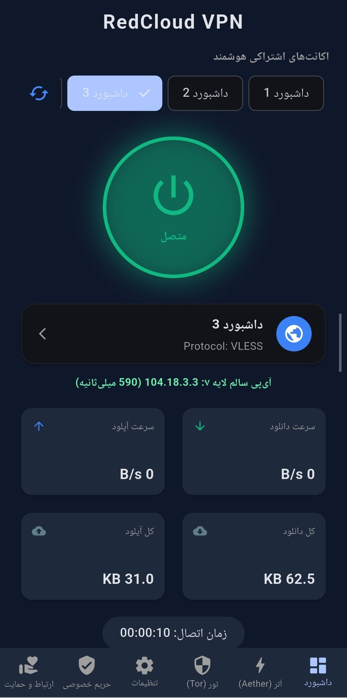
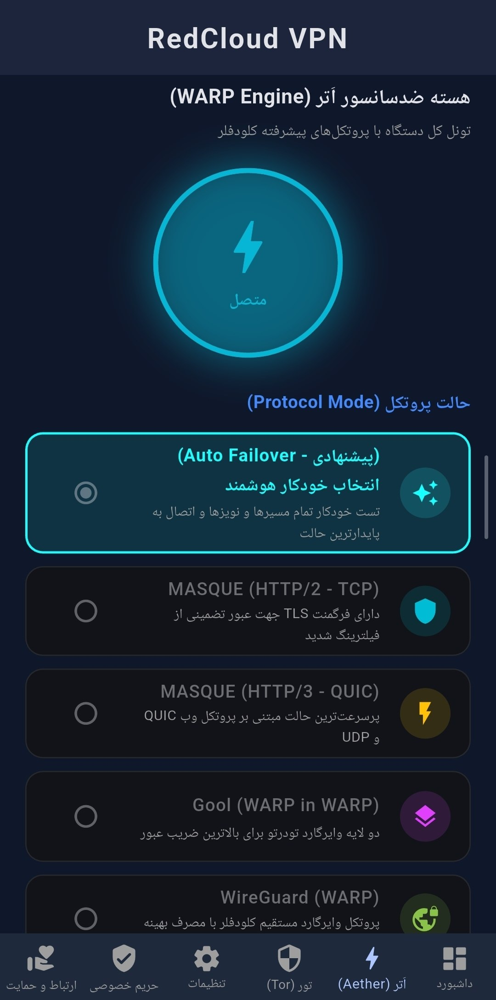
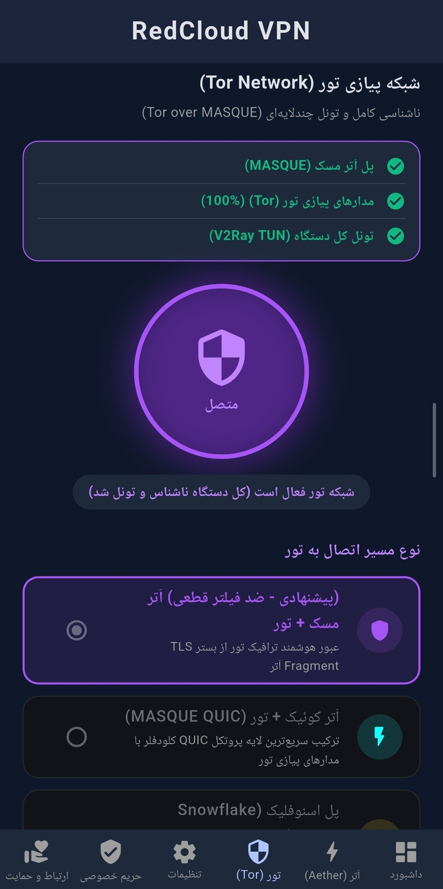
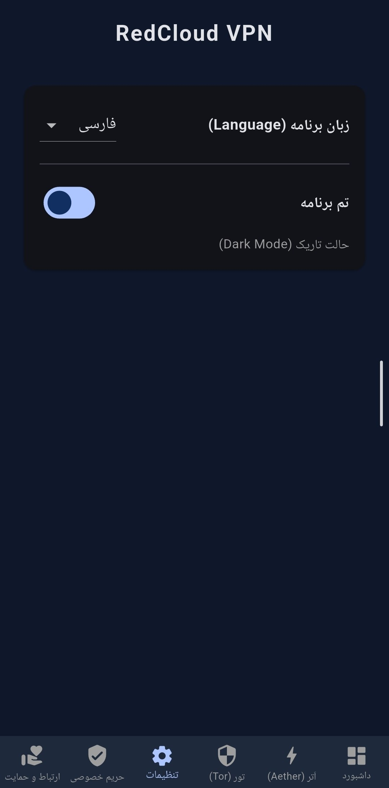
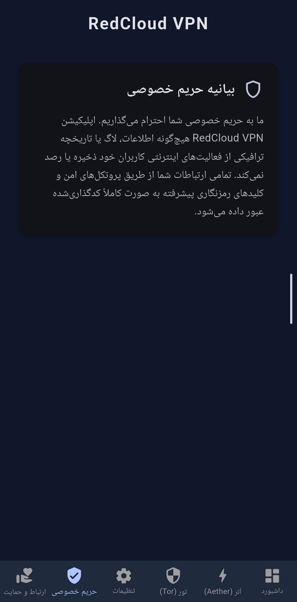

<div align="center">

# 🛡️ RedCloud VPN (نسخه چند‌هسته‌ای اندروید)

### کلاینت نسل جدید ضدسانسور، فوق‌سریع و هوشمند برای اندروید

**Next-Generation Multi-Core Anti-Censorship Client for Android Powered by Flutter, V2Ray, Aether & Tor**

[](https://github.com/Devtahas/RedCloud-Android/releases/latest)
[](LICENSE)
[-3DDC84?style=for-the-badge&logo=android&logoColor=white)](https://github.com/Devtahas/RedCloud-Android/releases/latest)
[](https://flutter.dev)
[](https://kotlinlang.org)
[](https://github.com/v2fly/v2ray-core)
[](https://www.torproject.org)
[](https://t.me/DevTaha_project)

<br>


<p align="center">
<b>ردکلاود اندروید (RedCloud Android)</b> یک کلاینت جامع، سبک و فوق‌العاده مقاوم در برابر شدیدترین اختلالات و فیلترینگ اینترنت است که با ترکیب لایه کاربری مدرن <b>Flutter</b> و هسته‌های باینری بومی <b>Aether (WARP/MASQUE)</b>، <b>Tor</b> و <b>V2Ray Core</b> توسعه یافته است.
</p>

[📥 دانلود مستقیم فایل APK](https://github.com/Devtahas/RedCloud-Android/releases/latest) • [📢 کانال تلگرام](https://t.me/DevTaha_project) • [📖 راهنمای کاربری](#-راهنمای-دانلود-و-نصب) • [❤️ حمایت مالی](#-حمایت-مالی-از-پروژه-donate)

</div>

---

## 🌟 معماری شبکه و جریان ترافیک (Traffic Flow)

اپلیکیشن بسته به تب انتخابی، ترافیک کل دستگاه را با پروتکل‌های پیشرفته ضدسانسور عبور می‌دهد:

```text
[ کل ترافیک گوشی / برنامه‌ها / بازی‌ها / مرورگرها ]
                        │
                        ▼
       [ سرویس وی‌پی‌ان اندروید (V2Ray TUN Service) ]
                        │
        ┌───────────────┼───────────────┐
        ▼               ▼               ▼
   [ ۱. داشبورد ]  [ ۲. اَتر مسک ]  [ ۳. شبکه تور ]
     VLESS over      MASQUE H2/H3     Tor over MASQUE
     WebSocket +      TLS Fragment     + Onion Circuits
     Clean L7 IP      Anycast Edge     + Snowflake
        │               │               │
        └───────────────┼───────────────┘
                        ▼
           [ لایه ابری Cloudflare Edge ]
                        │
                        ▼
               [ اینترنت آزاد و امن ]
```

## 📸 تصاویر محیط نرم‌افزار (Screenshots)

<div align="center">
<table>
<tr>
<td width="50%">
<h4 align="center">۱. داشبورد و اکانت‌های اشتراکی هوشمند</h4>

</td>
<td width="50%">
<h4 align="center">۲. هسته ضدسانسور اَتر (WARP Engine)</h4>

</td>
</tr>
<tr>
<td width="50%">
<h4 align="center">۳. شبکه پیازی تور (Tor over MASQUE)</h4>

</td>
<td width="50%">
<h4 align="center">۴. تنظیمات تم و زبان برنامه</h4>

</td>
</tr>
<tr>
<td width="50%">
<h4 align="center">۵. بیانیه شفافیت و حریم خصوصی</h4>

</td>
<td width="50%">

</tr>
</table>
</div>

## ✨ قابلیت‌ها و ویژگی‌های کلیدی

### ⚡ ۱. اسکنر واقعی لایه ۷ کلودفلر با فال‌بک دیتابیس بزرگ (L7 Scanner)

- اسکن واقعی لایه ۷ (Application Layer): برقراری سوکت TCP، تکمیل هندشیک TLS با SNI اختصاصی و ارسال درخواست GET Upgrade: websocket تا تأیید قطعی پاسخ HTTP/1.1 101 Switching Protocols.
- موتور فال‌بک خودکار (Deep CIDR Fallback): در صورت عدم پاسخ آی‌پی‌های پیش‌فرض، برنامه بلافاصله با بنر ۵ ثانیه‌ای به دیتابیس جامع `cloudflare_IPs.txt` سوئیچ کرده و از هر ساب‌نت ۵۰ هاست را به صورت موازی اسکن می‌کند.

### 🛡️ ۲. سیستم ضد مسمومیت و نجات هوشمند دی‌ان‌اس (Anti-DNS Poisoning & Rescue)

- اعتبارسنجی با پکت خام UDP: ارسال پکت باینری به سرورها و فیلتر کردن دقیق آی‌پی‌های صفحه فیلترینگ و پیوندهای ایران (`10.10.34.x` و `10.x.x.x`).
- موتور بازیابی از دیتابیس `DNS.txt`: در صورت مسمومیت دی‌ان‌اس سیستم‌عامل، پرسرعت‌ترین و امن‌ترین سرورهای DNS انتخاب و جایگزین می‌شوند.

### 🚀 ۳. هسته اختصاصی اَتر (Aether WARP & MASQUE Engine)

- **MASQUE (HTTP/2 - TCP):** مجهز به قطعه‌بندی پکت‌های TLS (Fragmentation با اندازه ۱۶ الی ۳۲ بایت و تاخیر ۲ الی ۸ میلی‌ثانیه) جهت عبور تضمینی از شدیدترین اختلالات فیلترینگ.
- **MASQUE (HTTP/3 - QUIC):** اتصال فوق‌سریع بر بستر پروتکل وب UDP کلودفلر بدون تاخیر هندشیک.
- **Gool (WARP in WARP) & WireGuard:** ایجاد دو لایه وایرگارد تودرتو برای بالاترین ضریب پایداری و بهینه‌سازی مصرف باتری.

### 🧅 ۴. شبکه پیازی تور با عبور امن از بستر مسک (Tor over MASQUE)

- زنجیره‌سازی Tor over MASQUE: ترافیک مدارهای پیازی تور از داخل تونل اَتر مسک رد می‌شود تا اپراتورها نتوانند ارتباط تور را شناسایی یا مسدود کنند.
- رهگیری زنده پیشرفت اتصال (Bootstrap Tracker): نمایش خط‌به‌خط وضعیت اتصال مدارهای تور از ۰٪ تا ۱۰۰٪ با گرافیک پیشرفته.
- پشتیبانی از پل‌های اسنوفلیک (Snowflake) و پل‌های سفارشی کاربر (Custom Bridges).

### 🔄 ۵. چرخش هوشمند اکانت‌ها و مدیریت مصرف (Smart Account Sync)

- همگام‌سازی خودکار اکانت‌های فعال VLESS از ریپازیتوری مرکزی گیت‌هاب با رتبه‌بندی اولویت (Priority).
- رصد زنده مصرف حجم روزانه و سوئیچینگ خودکار به اکانت سالم بعدی در صورت تکمیل حجم مجاز.

### 📱 ۶. طراحی مدرن، سبک و دوزبانه (UI/UX)

- پیاده‌سازی شده بر پایه متریال دیزاین ۳ با تم تاریک (Dark Mode) و روشن (Light Mode).
- پشتیبانی کامل و روان از زبان‌های فارسی و English با سوئیچ در لحظه.

## 📥 راهنمای دانلود و نصب

### روش پیشنهادی: دانلود فایل APK آماده

1. به صفحه آخرین انتشار (Releases) بروید.
2. بسته به پردازنده گوشی خود، فایل مناسب را دانلود کنید:
   - 📱 **RedCloud-Universal.apk** (پیشنهادی - سازگار با ۱۰۰٪ تمامی گوشی‌ها)
   - ⚡ **RedCloud-arm64-v8a.apk** (گوشی‌های جدید ۶۴ بیتی - کم‌حجم‌تر)
   - 📦 **RedCloud-armeabi-v7a.apk** (گوشی‌های قدیمی ۳۲ بیتی)
3. فایل را روی گوشی نصب کرده و با فشردن دکمه اتصال، از اینترنت بدون فیلتر لذت ببرید.

## 🛠️ کامپایل و بیلد از سورس‌کد (برای توسعه‌دهندگان)

### پیش‌نیازها

- Flutter SDK نسخه ۳.۲۰ به بالا
- Java Development Kit (JDK) نسخه ۱۷
- Android SDK با Target SDK 34/35

```powershell
# ۱. کلون کردن ریپازیتوری
git clone https://github.com/Devtahas/RedCloud-Android.git
cd RedCloud-Android

# ۲. دریافت وابستگی‌های فلاتر
flutter pub get

# ۳. اجرای زنده روی گوشی یا شبیه‌ساز (Debug Mode)
flutter run

# ۴. تولید فایل نصبی ریلیز یونیورسال (Universal APK)
flutter build apk --release --android-skip-build-dependency-validation

# ۵. تولید فایل‌های نصبی تفکیک‌شده معماری (Split APKs)
flutter build apk --release --split-per-abi --android-skip-build-dependency-validation
```

فایل‌های خروجی در مسیر زیر تولید می‌شوند:

📁 `build/app/outputs/flutter-apk/`

## 📂 ساختار سورس‌کد پروژه (Project Structure)

```text
RedCloud-Android/
├── .github/
│   └── workflows/
│       └── release.yml              # پایپ‌لاین CI/CD بیلد خودکار و انتشار Release
├── android/
│   ├── app/
│   │   ├── src/main/
│   │   │   ├── jniLibs/             # باینری‌های Native کامپایل‌شده (libaether.so, libtor.so)
│   │   │   ├── assets/              # باینری‌های Fallback و دیتابیس تور (geoip, geoip6)
│   │   │   └── kotlin/.../MainActivity.kt  # پل ارتباطی نیتیو کاتلین (MethodChannels)
│   │   └── build.gradle.kts         # تنظیمات گریدل و پکیجینگ اندروید
│   ├── build.gradle.kts             # پیکربندی مخازن و مسیر بیلد
│   └── settings.gradle.kts          # مدیریت وابستگی‌ها و پلاگین فلاتر
├── assets/
│   ├── cloudflare_IPs.txt           # دیتابیس جامع رنج‌ها و ساب‌نت‌های کلودفلر
│   ├── DNS.txt                      # دیتابیس سرورهای DNS جهت تست و بازیابی
│   └── images/                      # لوگو و دارایی‌های گرافیکی نرم‌افزار
├── lib/
│   └── main.dart                    # کلاینت اصلی فلاتر، مدیریت هسته‌ها، اسکنر لایه ۷ و UI
├── screenshots/                     # تصاویر اسکرین‌شات محیط برنامه برای مستندات
├── pubspec.yaml                     # لیست وابستگی‌ها و دارایی‌های فلاتر
└── README.md                        # مستندات پروژه
```

## 📜 پروانه و شرایط استفاده (License)

این نرم‌افزار تحت پروانه بین‌المللی Apache License 2.0 منتشر شده است.

- ✅ **استفاده و مطالعه سورس‌کد:** بررسی کدهای پروژه، یادگیری و استفاده شخصی کاملاً آزاد و متن‌باز است.
- ⚠️ **حقوق انحصاری برند و نام تجاری (Trademark Protection):** استفاده از نام تجاری "RedCloud"، "RedCloud VPN"، لوگوها و هویت گرافیکی رسمی پروژه در نسخه‌های فورک‌شده یا برنامه‌های اشتقاقی ممنوع است و توسعه‌دهندگان دیگر موظفند نسخه‌های تغییریافته خود را با نام و برند کاملاً مستقل منتشر نمایند.

## ❤️ حمایت مالی از پروژه (Donate)

توسعه، به‌روزرسانی منظم و نگهداری اکانت‌های ضدسانسور نیازمند سرورهای پایدار و منابع مالی است. با حمایت مالی خود به پایداری این پروژه و گسترش دسترسی آزاد به اینترنت کمک کنید:

<div align="center">

| شبکه (Network)          | رمزارز (Asset) | آدرس کیف پول (Wallet Address)              |
| ----------------------- | -------------- | ------------------------------------------ |
| BNB Smart Chain (BEP20) | USDT (تتر)     | `0xDeda28Aa73Ec089A77B3fC616E0011a8fce12900` |

</div>

## 📢 ارتباط با ما و اطلاع‌رسانی

- 💬 کانال رسمی تلگرام: [@DevTaha_project](https://t.me/DevTaha_project)
- 🐙 مخزن رسمی گیت‌هاب: [Devtahas/RedCloud-Android](https://github.com/Devtahas/RedCloud-Android)
- 🐛 گزارش خطاها و پیشنهادات: [GitHub Issues](https://github.com/Devtahas/RedCloud-Android/issues)

<div align="center">
<sub>ساخته شده با ❤️ برای آزادی اینترنت و حق دسترسی آزاد به اطلاعات برای همه کاربران</sub>
</div>
